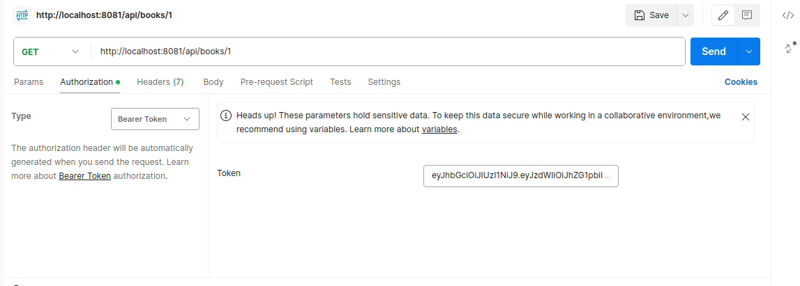

# Library Management System

## Install and Run
Set up the database with the following properties:
<br>database name: library management
<br>username: libraryDB
<br>password: libraryDB

To start the application run the following command inside the application folder.
```bash
docker-compose up
```
## Project Flow
There are 2 types of users Admin and Moderator. 
Only an admin user can create moderator users.

At the start of the project an admin user is created with the following credentials
<br>username: admin
<br>password: admin
<br>You can login using these credentials to obtain the jwt token throught the following link.

**http://localhost:8081/api/login**
- `POST`: Login for an existing user

**Request Body**
```json
{
  "username": "admin",
  "password": "admin"
}
```
**Response Body**
```json
{
  "token": "exampletoken"
}
```
<br>
To use the token with postman choose the Authentication tab in postman and then choose the Bearer Token and put the token in the Token field.



## API
### Auth API
**http://localhost:8081/api/register**
- `POST`: Create a new user and return auth token.


**Request Body**
```json
{
  "username": "user",
  "password": "password"
}
```
**Response Body**
```json
{
  "token": "exampletoken"
}
```
___
**http://localhost:8081/api/login**
- `POST`: Login for an existing user

**Request Body**
```json
{
  "username": "user",
  "password": "password"
}
```
**Response Body**
```json
{
  "token": "exampletoken"
}
```
___
### Books APIs
**http://localhost:8081/api/books**
- `GET`: Get list of books.

**Response Body**
```json
[
    {
        "id": 1,
        "title": "Master Spring Boot",
        "author": "Ali",
        "publicationYear": "20",
        "isbn": "1324986534",
        "state": "AVAILABLE"
    },
    {
        "id": 2,
        "title": "Master Spring Boot",
        "author": "Ali",
        "publicationYear": "20",
        "isbn": "1324986534",
        "state": "AVAILABLE"
    }
]
```
<br><br>
- `POST`: Create a new book.

**Request Body**
```json
{
    "title":"Master Spring Boot",
    "author":"Ali",
    "publicationYear":"20",
    "isbn":"1324986534"
}
```
**Response Body**
```json
{
    "id": 1,
    "title": "Master Spring Boot",
    "author": "Ali",
    "publicationYear": "20",
    "isbn": "1324986534",
    "state": "AVAILABLE"
}
```
<br><br>
**http://localhost:8081/api/books/{id}**
- `GET`: Get an book by id.

**Response Body**
```json
{
    "id": 1,
    "title": "Master Spring Boot",
    "author": "Ali",
    "publicationYear": "20",
    "isbn": "1324986534",
    "state": "AVAILABLE"
}
```
- `DELETE`: Delete an book by id.
<br><br>
- `PUT`: Update an existing book by id.

**Request Body**
```json
{
    "title":"Master Spring Boot",
    "author":"Ali",
    "publicationYear":"20",
    "isbn":"1324986534"
}
```
**Response Body**
```json
{
    "id": 1,
    "title": "Master Spring Boot",
    "author": "Ali",
    "publicationYear": "20",
    "isbn": "1324986534",
    "state": "AVAILABLE"
}
```

___
### Patrons APIs
**http://localhost:8081/api/patrons**
- `GET`: Get list of patrons.

**Response Body**
```json
[
    {
        "id": 1,
        "firstName": "John",
        "lastName": "Doe",
        "email": "JohnDoe@example.com",
        "address": "asd asd"
    },
    {
        "id": 2,
        "firstName": "Mike",
        "lastName": "Blank",
        "email": "mblank@example.com",
        "address": "asd asd"
    }
]
```
<br><br>
- `POST`: Create a new patron.

**Request Body**
```json
{
    "firstName":"John",
    "lastName":"Doe",
    "email":"JohnDoe@example.com",
    "address":"asd asd"
}
```
**Response Body**
```json
{
    "id": 1,
    "firstName": "John",
    "lastName": "Doe",
    "email": "JohnDoe@example.com",
    "address": "asd asd"
}
```
<br><br>

**http://localhost:8081/api/patrons/{id}**
- `GET`: Get an patron by id.

**Response Body**
```json
{
    "id": 1,
    "firstName": "John",
    "lastName": "Doe",
    "email": "JohnDoe@example.com",
    "address": "asd asd"
}
```
<br><br>

- `DELETE`: Delete an patron by id.
<br><br>

- `PUT`: Update an existing patron by id.

**Request Body**
```json
{
    "firstName":"John",
    "lastName":"Doe",
    "email":"JohnDoe@example.com",
    "address":"asd asd"
}
```
**Response Body**
```json
{
    "id": 1,
    "firstName": "John",
    "lastName": "Doe",
    "email": "JohnDoe@example.com",
    "address": "asd asd"
}
```
___
### Borrwing APIs
**http://localhost:8081/api/borrow/{bookId}/patron/{patronId}**
- `POST`: Allow a patron to borrow a book.

**Response Body**
```json
{
    "id": 1,
    "book": {
        "id": 1,
        "title": "Master Spring Boot",
        "author": "Ali",
        "publicationYear": "20",
        "isbn": "1324986534",
        "state": "BORROWED"
    },
    "patron": {
        "id": 1,
        "firstName": "John",
        "lastName": "Doe",
        "email": "JohnDoe@m.com",
        "address": "asd asd"
    },
    "borrowDate": "2024-04-09T19:11:09.793750336",
    "returnDate": null
}
```
**http://localhost:8081/api/api/borrow/{bookId}/patron/{patronId}**
- `PUT`: Record the return of a borrowed book by a patron.

**Response Body**
```json
{
    "id": 1,
    "book": {
        "id": 1,
        "title": "Master Spring Boot",
        "author": "Ali",
        "publicationYear": "20",
        "isbn": "1324986534",
        "state": "AVAILABLE"
    },
    "patron": {
        "id": 1,
        "firstName": "John",
        "lastName": "Doe",
        "email": "JohnDoe@m.com",
        "address": "asd asd"
    },
    "borrowDate": "2024-04-09T19:11:09.79375",
    "returnDate": "2024-04-09T19:15:08.925079455"
}
```
___
